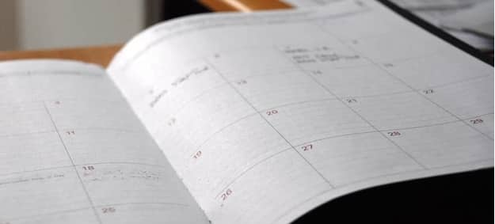

## Calendar and schedule 

### Upcoming topics 
- 08.04.20: Review, the linear model framework

### Past topics
- 15.5.19: Principles of frequentist statistics (Field ch. 1)
- 12.6.19: Principles of frequentist statistics, cont. (Field ch. 2 & Data skills parts 1-2)
- 26.6.19: Tidy data, Data types and preprocessing (Ch. 5 & 12 in R for Data Science, Data skills parts 4-6)
- 10.7.19: Exploring assumptions (Field ch. 5)
- 24.7.19: Graphing with ggplot (Ch. 3 & 7 R for Data Science, Data skills part 3)
- 24.10.19: Correlation (Field ch. 6)
- 7.11.19: Regression (Field ch. 7)
- 21.11.19: Correlation and regression recap (Simmons et al 2011, Leek et al 2015)
- 5.12.19: Logistic regression (Field ch. 8)
- 19.12.19: Catch-up session
- 9.1.20: Comparing means: t-test (Field ch. 9)
- 23.1.20: ANOVA (Levshina Sections 8.1-8.3.3 and Sections 7.1-7.2.4)
- 12.2.20: Tests of independence: Chi-square & co.
- 26.2.20: TidyTuesday ggplot practice
- March 2020 interrupted due to COVID-19

